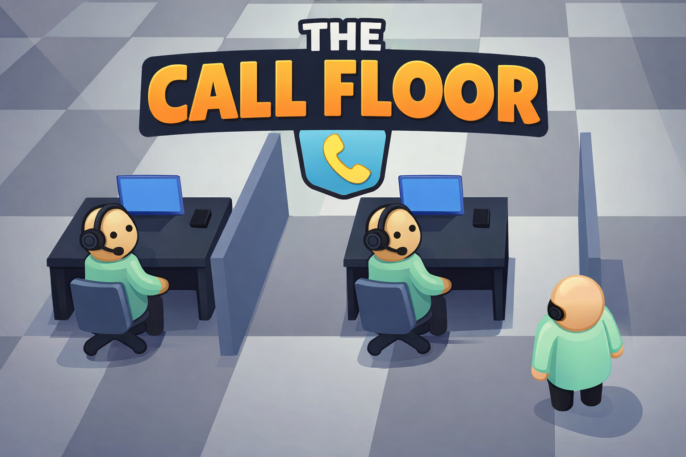

# The Call Floor

<p align="center">
  
</p>

<p align="center">
  <strong>🎮 A 3D Call Center Management Tycoon Game</strong>
</p>

<p align="center">
  <a href="#-play-now">Play Now</a> •
  <a href="#-features">Features</a> •
  <a href="#-controls">Controls</a> •
  <a href="#-upgrades">Upgrades</a> •
  <a href="#-contributing">Contributing</a>
</p>

---

## 🎯 About

**The Call Floor** is a browser-based 3D tycoon game where you build and manage your own call center empire. Hire agents, purchase upgrades, manage leads, and grow your business from a small operation to a thriving call center!

Built with **Three.js** for immersive 3D graphics, the game runs entirely in your browser - no downloads required.

## 🎮 Play Now

1. Clone this repository
2. Open `index.html` in your browser, or
3. Run a local server: `python -m http.server 8080`
4. Navigate to `http://localhost:8080`

## ✨ Features

- **3D Environment**: Fully rendered call center with desks, agents, and office furniture
- **Agent Management**: Hire, train, and manage your sales team
- **Energy System**: Agents get tired and need breaks - hire a supervisor to help!
- **12 Upgrades**: From lead generation to predictive dialers
- **Tutorial System**: Learn the game mechanics step-by-step
- **Save/Load**: Your progress is automatically saved
- **Milestone Achievements**: Bronze, Silver, and Gold goals

## 🎛️ Controls

| Key | Action |
|-----|--------|
| **WASD** | Move around the office |
| **E** | Purchase upgrade (when on pad) |
| **F** | Wake sleeping agent |
| **H** | Open help screen |
| **SPACE** | Pause/Resume game |
| **1-4** | Set game speed |
| **ESC** | Close overlays / Skip tutorial |

## 🛒 Upgrades

### 📋 Essentials (Row 1)
| Upgrade | Cost | Effect |
|---------|------|--------|
| 50 Leads | $100 | +50 warm leads (17% contact rate!) |
| 200 Leads | $350 | Bulk lead package |
| Hire Agent | $200+ | Add another sales rep |
| Script Training | $150+ | +5% conversion per level |
| Local Presence | $300+ | +8% answer rate |

### ⚡ Tech & Facilities (Row 2)
| Upgrade | Cost | Effect |
|---------|------|--------|
| Coffee Machine | $300 | Slower energy drain |
| Ergo Chairs | $400+ | -20% energy drain |
| Power Dialer | $500 | 2x dial speed |
| Predictive Dialer | $1500 | AI-powered +40% efficiency |
| Analytics | $600+ | Better optimization |

### 🎧 Management (Row 3)
| Upgrade | Cost | Effect |
|---------|------|--------|
| Supervisor | FREE | Auto-wakes sleeping agents |
| QA Team | $800+ | +10 reputation, prevents decay |

## 🏆 Victory Goals

| Achievement | Requirement |
|-------------|-------------|
| 🥉 Bronze | Day 10 with $2,000+ |
| 🥈 Silver | Day 20 with $5,000+ |
| 🥇 Gold | Day 30 with $10,000+ |

## 🔧 Tech Stack

- **Three.js** - 3D rendering
- **Vanilla JavaScript** - Game logic
- **HTML5/CSS3** - UI/UX
- **LocalStorage** - Save system

## 📁 Project Structure

```
TheCallFloor/
├── index.html      # Main HTML with UI and styles
├── game.js         # All game logic, 3D scene, mechanics
├── three.min.js    # Three.js library
├── logo.png        # Project logo
├── LICENSE         # MIT License
├── CONTRIBUTING.md # Contribution guidelines
└── README.md       # This file
```

## 🤝 Contributing

We welcome contributions! Please see [CONTRIBUTING.md](CONTRIBUTING.md) for guidelines.

## 📄 License

This project is licensed under the MIT License - see the [LICENSE](LICENSE) file for details.

## 👨‍💻 Author

Created by **Ryan Shatz** ([@ryanshatz](https://github.com/ryanshatz))

---

<p align="center">
  Made with ❤️ and ☕
</p>
